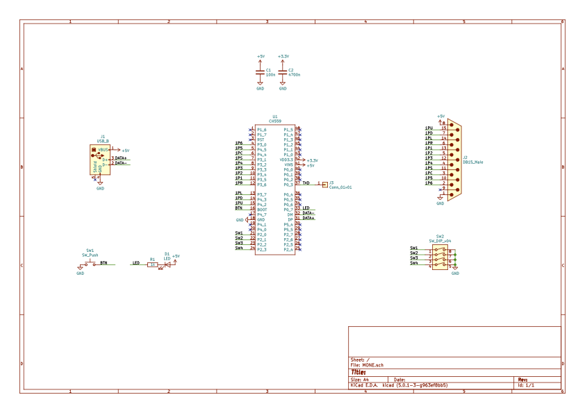

# MONE - Mini console Oriented gamepad converter for NEOGEO.

## Overview

This is a small box for you to use NEOGEO gamepad on playing multiple mini consoles.
Currently it supports

- NEOGEO mini
- MEGADRIVE mini
- PC-Engine mini
- Playstation Classic
- Retro-bit Generations IV (and maybe other variants)

Also it supports features to configure button layout, and assign rapid fire mode for arbitrary buttons.

## Features

### Multiple console supports

MONE is recognized as a USB HID device, and it's device information will change based on DIPSW.
If you change DIPSW, the device will reconnect and the host will recognize the new console mode.

Here is the list for DIPSW.

- 000x: NEOGEO mini
- 100x: MEGADRIVE mini
- 010x: PC-Engine mini
- 110x: Playstation Classic
- 001x: Retro-bit Generations
- 101x: (reserved)
- 011x: (reserved)
- 111x: (reserved)

DIPSW 4 is not used to choose a mini console mode, but you can save layout and rapid fire settings for each.
So, you can have 2 different settings for each console.

### Button Layout

Once you push the button on the PCB, MONE goes into a button layout configuration mode. You can choose arbitray physical button sets for logical button 1, 2, 3, 4, 5, 6, 7, and 8. You can choose multiple physical buttons for one logical button, and can assign one of them as a rapid fire mode, e.g. choosing physical button 1 and 3 for the logical button 1, and button 3 can be a rapid fire button for the 1.

By default, MONE assumes that the physical button layout is something like this:

```
       2     3
  1
      5    6
4
```

And each console mode maps these physical buttons into their own buttons.
Here is the matrix.

| Mode \ Button         | 1 | 2 | 3 | 4 | 5 | 6 | 7 | 8 |
|-----------------------|---|---|---|---|---|---|---|---|
| NEOGEO mini           | B | C | D | A | - | - | - | - |
| MEGADRIVE mini        | A | B | C | X | Y | Z | - | - |
| PC-Engine mini        | II| I | - | - | - | - | - | - |
| Playstation Classic   | □ | × | ○ | △ |L2 |R2 |L1 |R1 |
| Retro-bit Generations | 1 | 2 | 3 | 4 | 5 | 6 | - | - |

You can change the layout for each mode as follows.

Steps:

1. Puth the button on the PCB
2. Push gamepad buttons for the logical button 1 (e.g. B on NEOGEO mini), and release them
3. Push gamepad buttons for the logical button 2 (e.g. C on NEOGEO mini), and release them
4. Continue for 3, 4, ..., and 8
5. Push the button on the PCB to configure rapid fire buttons

You can quit the layout configuration mode anytime by pushing the button on the PCB.
If you skip all, layout won't be changed, but if you set some buttons partially, remaining buttons are assigned to no button.

### Rapid Fire

After setting the layout mode, you can enter the rapid fire configuration mode.
Push buttons those you want to make it rapid fire buttons, then push the button on the PCB again.
You can got to the rapid fire speed setting mode.

For instance, you can assign physical buttons 1 and 3 to logical button B in the layout mode, and can assign button 3 as a rapid fire button B here. Thus, you can use gamepad button 1 for a normal button B, and use button 3 for a rapid fire button B.

Once you quit the rapid fire configuration mode, now you can choose the rapid fire speed.
Push one of following button to select the speed. Note that the number is for specifying the button in the original physical layout. You can quit the speed setting mode by pushing the button on the PCB. Now you can get back to the normal operation.

| Button |  1 |  2 |  3 |  4 |
|--------|----|----|----|----|
| Speed  | 12 | 15 | 20 | 30 |

### Settings

When you finish the layout and rapid fire settings, all configurations are stored into the flash ROM.
You can save the settings per each DIPSW mode, that means you can keep 2 settings for each console mode.

### 6 Buttons

The original NEOGEO has only 4 buttons, but there are unused pins. MONE uses these unused pins for button 5 and 6.
This is the same with some Japanese arcade control boxes. See the schematics below to check details.

Also, complete KiCad data is available in the repository so to order your own PCB.

## Schematics
